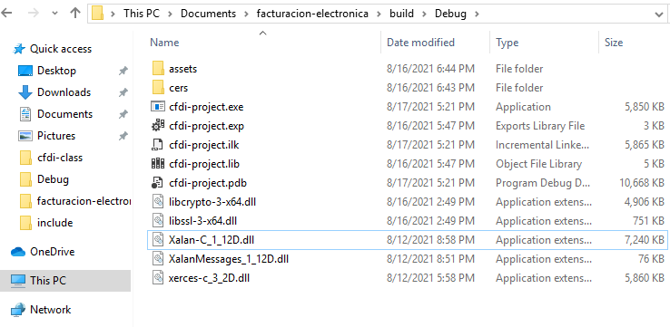

# CFDI

(En progreso)

# El proyecto ya se logró compilar en Windows :)

Facturación electrónica (SAT, México) en C++

# Progreso

La aplicación es capaz de:

1. crear XML de comprobante
2. leer el certificado
3. crear cadena original
4. crear XML con algunos datos del certificado(falta sello. La función para sellar
   se añadirá en la librería ssl_functions).

# Building

Compilación de las dependencias.

Para esta configuración yo instalé todas las librerías en `C:\`.

con el siguiente comando se descargarán las dependencias en la carpeta external(Xerces, Xalanc, cfdi-class y openSSL)

    git submodule update --init --recursive

## XercesC

entra en la carpeta de xerces-c y corre el siguiente comando con cmake:

    cmake -G "Visual Studio 15 2017 Win64" -S . -B build -DCMAKE_INSTALL_PREFIX=C:\xerces-c

ahora contruye el proyecto con:

    cmake --build build --config Debug

y finalmente lo instalas con:

    cmake --build build --config Debug --target install

## XalanC

Ahora hay que compilar xalanc

    cmake -DCMAKE_PREFIX_PATH=C:\xerces-c -G "Visual Studio 15 2017 Win64" -S . -B build -DCMAKE_INSTALL_PREFIX=C:\xalan-c

antes del siguiente paso necesitas localizar el archivo `xerces-c_3_2D.dll` en `/xerces-c/bin`(carpeta de instalación)  y copiarlo a `xalanc/build/src/xalanc/Utils/MsgCreator/Debug` o en la carpeta donde se encuentra `MsgCreator.exe` dentro de la carpeta build creada por cmake

ahora estas listo para construir xalanc con:

    cmake --build build --config Debug

y ahora lo instalas

    cmake --build build --config Debug --target install

## OpenSSL
 
Primero necesitas instalar [strawberry perl](https://strawberryperl.com) y [NASM](https://www.nasm.us)

Agrega NASM temporalmente al path con `set PATH=%PATH%;containing\NASM\folder`

Abre una consola de Visual Studio como administrador en la carpeta de openSSL y teclea

    perl Configure
    nmake
    nmake test
    nmake install

Y así ha quedado instalado openSSL

## XSD

Descarga en instala la siguiente librería [XSD download](https://www.codesynthesis.com/download/xsd/4.0/windows/i686/xsd-4.0.msi)

o ve a [www.codesynthesis.com](https://www.codesynthesis.com/products/xsd/download.xhtml)

## Listo

Ahora en la carpeta del proyecto:

    cmake -G "Visual Studio 15 2017 Win64" -S . -B build
    cmake --build build

Pero ahí no acaba todo; se supone que todo es más fácil Windows, ¿no?

Copia las carpetas cers y assets a la carpeta donde se encuentra el ejecutable cfdi-project.exe junto con las DLL's de xalan, xerces y openSSL; estan localizadas en la carpeta bin, respectivamente. Despues haré un script para automatizar todo esto.

La carpeta de tu ejecutable se verá así:

al ejecutar cfdi-project.exe se crean los archivos test.xml y sealed.xml

# TODO

    [ ] Hay un extraño error con la codificación. Por revisar.

